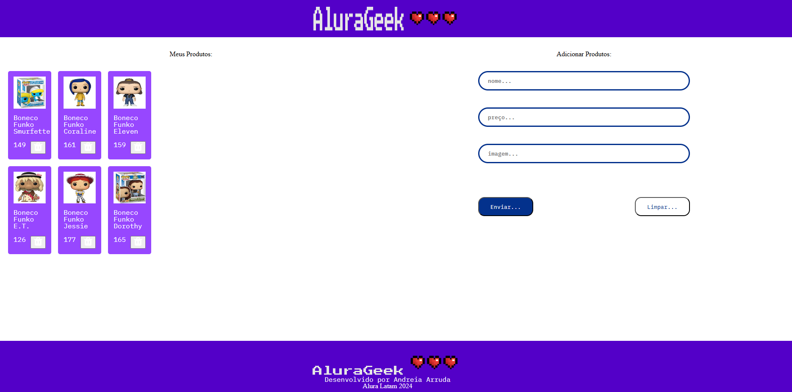

# AluraGeek

O projeto AluraGeek tem como objetivo gerenciar uma listagem de produtos geek. 
Nele possível visualizar, excluir e adicionar produtos.
 
 
**Funcionalidades**

 Visualizar produtos disponíveis; 
Excluir os produtos disponíveis; 
Adicionar outros produtos.  

 
**Tecnologias**

HTML5  
CSS  
JavaScript  
Mockapi  

**Uso**

Visualizar produtos: produtos disponíveis cadastrados. 
Adicionar produtos: inserindo os dados no formulário disponível. 
Excluir produtos: ao clicar no botão dentro de cada card com uma lixeira como ícone. 

